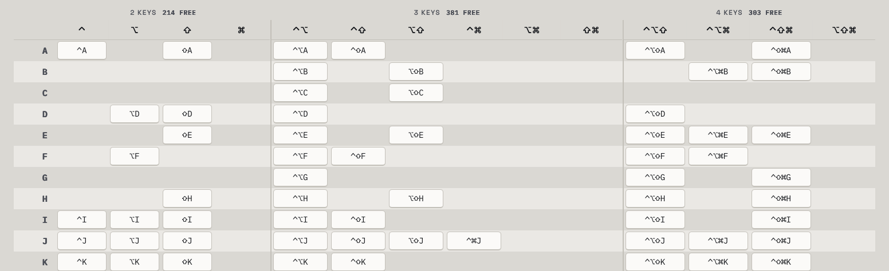
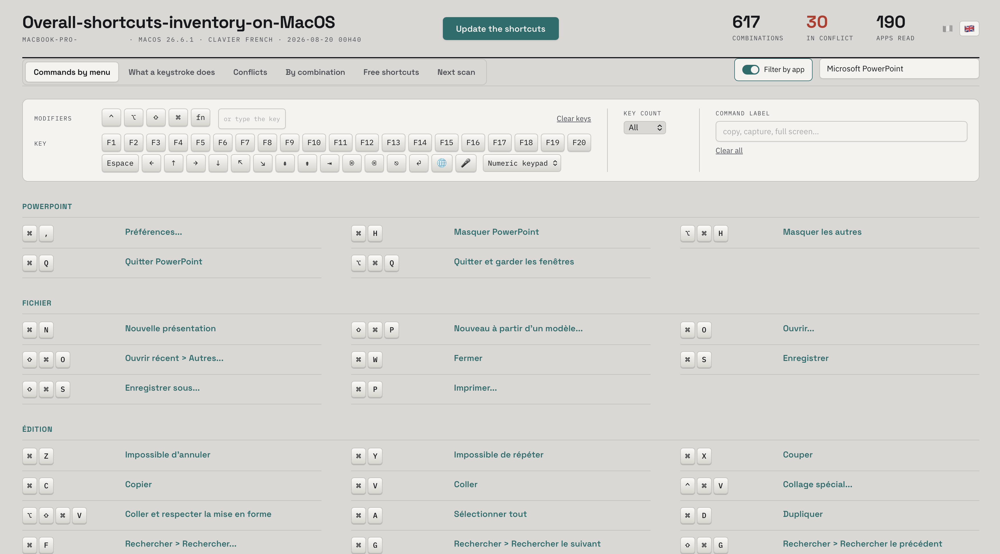
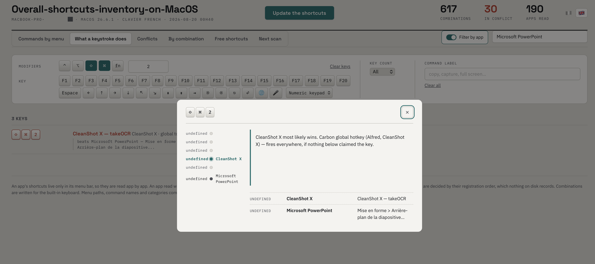
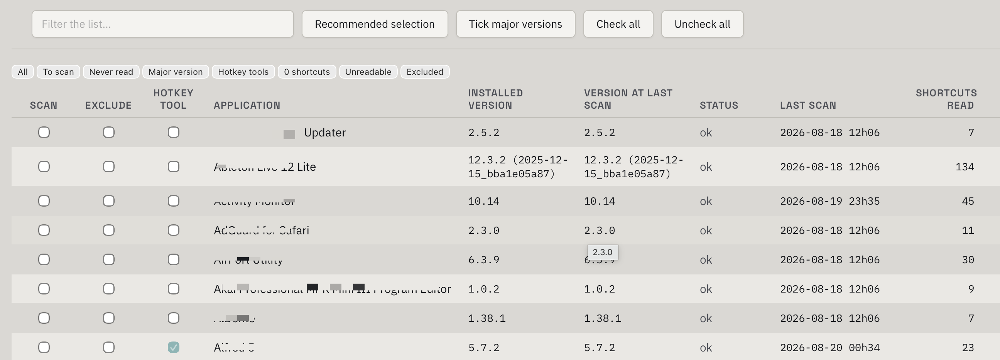
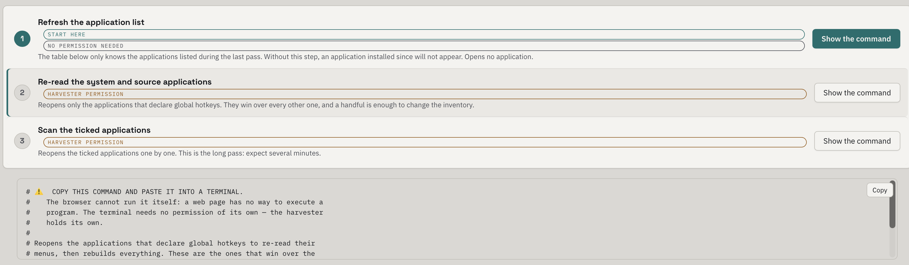

<div align="center">

# Overall-shortcuts-inventory-on-MacOS

**Every keyboard shortcut on your Mac, in a single page.**

The system, your third-party tools, and every installed application — read one by one,
then gathered into a page you open with a double-click.




<sub><b>Free shortcuts</b> — what is still unclaimed on this machine. One click copies a combination.</sub>

</div>

> [!WARNING]
> This tool requires macOS **accessibility permission** and **launches your applications
> automatically** to read their menus. Read [SECURITE.md](SECURITE.md) before the first
> pass: what it asks of your machine, what it produces, and what it does not do.
> *(Documentation is in French; the tool's own interface is French and English.)*

## The problem

You want to assign a shortcut and you have no idea what is already taken. You press one,
and a different command answers. Nothing on your Mac can tell you which keys are free.

No tool can, and there is a reason: **an application's shortcuts are written nowhere on
disk.** They are built in memory when the app launches, and can only be read from the live
menu bar. Existing tools therefore settle for the frontmost application, or for the ones
already running.

This one opens them one by one to read them, then closes them again.

## What you get

A **self-contained** HTML page — no server, no dependencies, opens in your browser and
works offline. Six views, in French and English.

| View | The question it answers |
|---|---|
| **Commands by menu** | What can I actually type in this application? |
| **What a keystroke does** | If I press this here, who receives the key? |
| **Conflicts** | What is fighting over a combination, and who wins? |
| **By combination** | Where does this combination do something, anywhere on the machine? |
| **Free shortcuts** | What is left that I can assign without breaking anything? |
| **Next scan** | Which applications are new or freshly updated, and which should I scan? |

### The views

**Commands by menu** — the app's own shortcuts, in the order of its menu bar, then the
global ones that reach it from outside.



**What a keystroke does** — pick an application, pick a combination, and see who actually
receives it there. Below, inside PowerPoint, ⇧⌘2 never reaches the menu command it belongs
to: a global hotkey from a screenshot tool catches the key first. The interception stack
names the layer that won and says why — this is the same conflict the Conflicts view
lists, seen from inside the app where it bites.



**Free shortcuts** — modifier sets against every assignable key, numeric keypad included.
Each free cell carries the whole combination, and one click copies it.

**Next scan** — the table of installed applications: version on disk against version at
the last read, status, date, shortcuts found, and three checkboxes.



The screen runs nothing itself. It states what each step costs — how many applications it
opens, and whether it needs the harvester's permission — then builds the exact command for
you to paste into a terminal:



> These screenshots are taken from the author's own machine and published deliberately.
> Yours is not meant to be: the page lists every piece of software you have installed, and
> [SECURITY.md](SECURITY.md) explains why that is worth keeping to yourself.

A **Markdown report** carries the same inventory in flat form — versionable and readable
offline.

## Getting started

```bash
git clone https://github.com/iconoclasteee/Overall-shortcuts-inventory-on-MacOS.git
cd Overall-shortcuts-inventory-on-MacOS

./build.sh          # builds the harvester (once)
./run.sh --sources  # ~10 s, opens no application
open out/raccourcis.html
```

`--sources` already gives you system shortcuts, third-party hotkeys, and the ones you have
redefined yourself. Covering your applications means opening them one by one: the page
builds the exact command, and you paste it into a terminal.

Authorising the harvester is a separate step, described in
[docs/utilisation.md](docs/utilisation.md#autorisation-daccessibilité).

## What makes the inventory correct

Three deliberate choices that separate this from a list copied from somewhere:

- **The keyboard layout decides, not the key code.** An ANSI table gives wrong answers on
  AZERTY. The mapping is asked of the system for the layout actually in use, at both
  levels — with and without Shift.
- **A conflict is settled by interception layer.** A keystroke descends a stack — keyboard
  driver, event tap, system shortcut, global hotkey, application menu — and the first
  layer served swallows the key. Between two claimants on the *same* layer, nothing on
  disk says who wins: the tool reports a tie rather than picking a winner at random.
- **No lookup table is written from memory.** Key codes, menu glyphs, system shortcuts and
  their localised labels are all extracted from macOS's own files.

And what it does not do, verifiable in the source: **no network access, no shell
command**, writes confined to `out/`, which is never committed — the page it produces is a
portrait of your machine.

## Going further

Reference documentation is in French.

| | |
|---|---|
| [**SECURITE.md**](SECURITE.md) | What the tool asks of your machine, and why. **Read this before the first pass.** |
| [**docs/utilisation.md**](docs/utilisation.md) | Modes, options, accessibility permission, what is never launched, known limits |
| [**docs/architecture.md**](docs/architecture.md) | Where the data comes from, how a conflict is settled, repository layout |

## Licence

**GPL-2.0** — see [LICENSE](LICENSE).

The interception-layer priority model, and the way menu shortcuts are read through the
accessibility API, are taken from
[HotkeyClash](https://github.com/Wunderlandmedia/HotkeyClash) by Wunderlandmedia, released
under GPL-2.0. This project therefore adopts the same licence.

Alternatives considered before building — CheatSheet, KeyCue,
[KeyMinder](https://keyminder.app/), HotkeyClash: all are look-up-as-you-go viewers, none
produces a complete inventory. The reasoning is in
[docs/architecture.md](docs/architecture.md).
